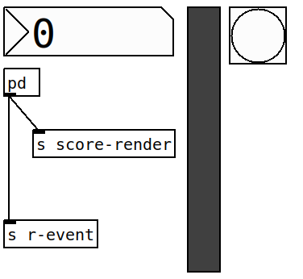
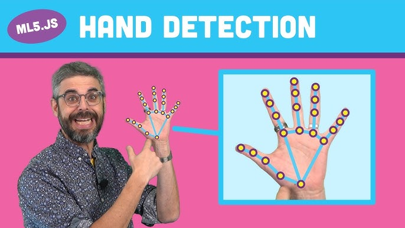

---
hide:
 - navigation
 - toc
---

# Home

 Welcome to the <code>pd4web</code> documentation! 

  { width="6%" }
  { width="6%" }

## <h2 align="center"> **What is pd4web?** </h2>

---

`pd4web` enables PureData functionality directly in web browsers. Not just the vanilla Pd, but Pd with all the externals!

### <h3 align="center"> **Key Features** </h3>

- `Streamlined Development`: Create fully online audio applications with a visual approach.
- `Easy Access`: Performers can access compositions without complex PureData setups or library dependencies.
- `Live Electronic Music Preservation`: Explore the potential of WebAudioApps to maintain the integrity of live electronic works. `pd4web` will download and make a repository for all code you need to run your music.

-------------------------
### <h3 align="center"> **Examples** </h3>
-------------------------

  

    <h3 class="card-title">Scofo Follower</h3>
    
    

      Show the use of the object <code>o.scofo~</code> with pd4web. Personal
      project for live-electronics.
    

  

  
  

    <h3 class="card-title">Didactic patches</h3>
    
    

      Used to exemplify the concept of Local Maxima used on Partial Tracking.
    

  

    

    <h3 class="card-title">VexFlow, Choir, and <code>pd4web</code></h3>
    
    

        Online algorithm piece that generate the piece based in the real-time spectrum.
    

  

---

  

    <h3 class="card-title"><code>p5js</code> with <code>pd4web</code></h3>
    
    
<code>p5js</code> and <code>pd4web</code> used together.

  

  

    <h3 class="card-title">Physical Modelling with <code>pmpd</code></h3>
    
    

        Using Physical Modelling for Synthesis.
    

  

  

    <h3 class="card-title">cartographie <code>p5js</code> + puredata</h3>
    
    
Project from Jean-Yves Gratius.

  

---

  

    <h3 class="card-title"><code>p5js</code>, <code>ml5</code> and <code>pd4web</code></h3>
    
    
Hand recognition with PureData. Stealing code from the Code-Train channel

  
 

 

  
 

  

 

---

## <h2 align="center"> **About me** </h2>

    
    

        I am Charles K. Neimog, a composer and researcher in the field of computer music. <code>pd4web</code> is a project to make possible the use of PureData in web browsers, improving the accessibility of electronic music. 
    

