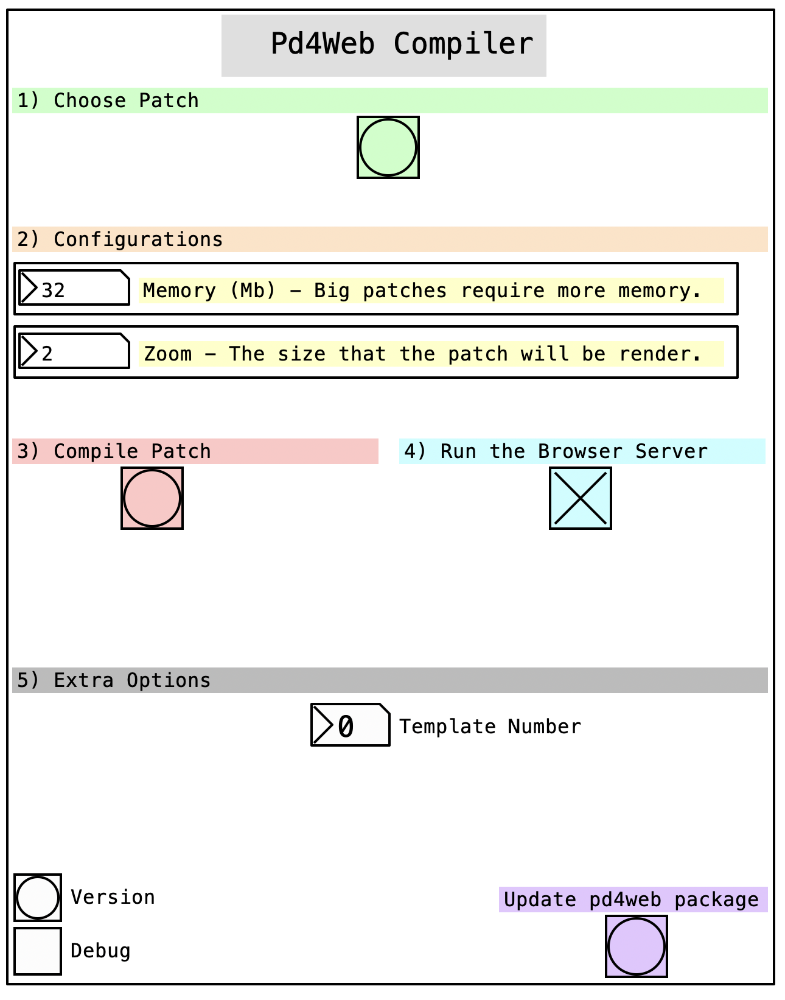

In this section, I will explain how to organize your project to compile your patch. It’s not much different from what you’re probably already doing, but you need to take special care with external files.


??? info "Want to know more?"
    The key issue is that all the files required by your patch must be available when the patch starts. Since we’re working with the web, imagine the problem if your patch needed a large audio file in the middle of a performance and PureData had to download it just milliseconds before it's needed. This would cause significant delays and freeze your patch for some seconds. Fortunately, `pd4web` handles this issue automatically, which is why it's important to specify the relevant folders.

## <h2 align="center">Folder Structure</h2>

I recommend using the file structure shown below. 

!!! warning
    Be careful with upper and lower case letters.

```
├─ PROJECT_FOLDER
└── Audios/
    ├── AllMyAudioFiles.wav
    └── AllMyAudioFiles.aif
└── Libs/
    ├── pdAbstraction1.pd
    └── pdAbstraction2.pd
└── Extras/
    ├── extrathings.png
    └── mygesture.svg
└── MY_MAIN_PATCH.pd
```

* In the `Audios` folder, you should place audio files. 

* In the `Libs` folder you store abstractions, text files, or any other relevant items.

* In the `Extras` folder, you should place items that are not intended for PureData but will be utilized to enhance the website's appearance. For instance, I use this folder to store `.svg` files of my scores, which I then display in the piece work in progress <a href="charlesneimog.github.io/Compiled-I" target="_blank">Compiled I.</a>

After you compile your patch, will be created in the ROOT of the project a file `index.html` and a new folder called `WebPatch`. All things that matter are inside the `WebPatch`. 

## <h2 align="center">How to use Abstractions?</h2>

Abstractions files must be inside `Libs` folder and be called as `Libs/myabs`. For now, use things like `declare -path Libs` and then trying to create `myabs` will not work!

## <h2 align="center">Compile your patch</h2>

To compile your `patch` using Pd you need to use the `pd4web` object and its help patch. To access it you can create a new patch, create the `pd4web` object, click with the right click on it, and click on help.

<p align="center" style="border-radius: 10px;">
        
</p>

### Options

Follow the numbers to compile your patch:


- Choose your patch file using the `green` button.

* From the `yellow` section, choose the memory size and the zoom level.
* Compile your patch using the `red` button.
* Run the server using the `blue` button.

You can also check the Template section to understand how to use [templates](templates/index.md).

!!! tip "Before start a new project, always click on `Update pd4web package`."
