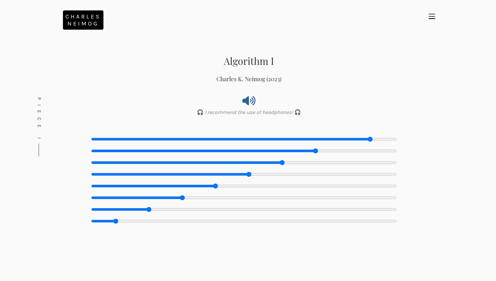

---
hide:
  - navigation
  - toc
---

# Introduction

 Welcome to the <code>PdWebCompiler</code> documentation! 

## <h2 align="center"> **What is PdWebCompiler?** </h2>

`PdWebCompiler` allows bring PureData functionality to web browsers using Web Audio technologies. This tool stands out from other approaches like [hvcc](https://github.com/Wasted-Audio/hvcc) and [WebPd](https://github.com/sebpiq/WebPd) because it compiles the [libpd](https://github.com/libpd/libpd) source, this is possible mainly because of the work of [claudeha](https://github.com/claudeha). You can compile any PureData vanilla patch and most of the externals.

-------------------------
### <h3 align="center"> **Some Examples** </h3>
-------------------------

    

