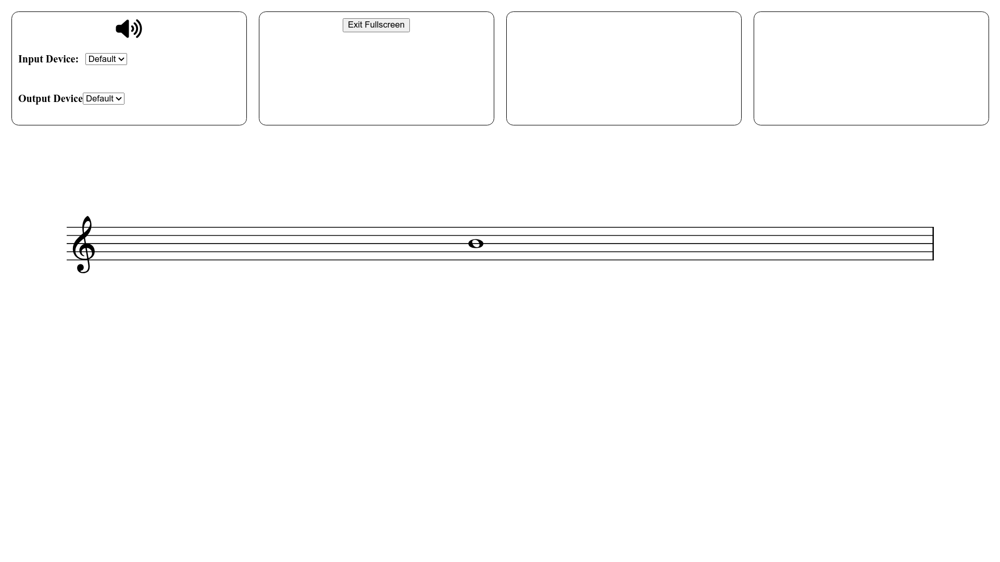

---
hide:
  - navigation
  - toc
---

# Introduction

 Welcome to the <code>PdWebCompiler</code> documentation! 

## <h2 align="center"> **What is PdWebCompiler?** </h2>

`PdWebCompiler` allows bring PureData functionality to browsers. This tool stands out from other approaches like [hvcc](https://github.com/Wasted-Audio/hvcc) (Command line that allows to compile to `wasm` and use it in JavaScript code) and [WebPd](https://github.com/sebpiq/WebPd) (WebSite that compiles PureData patches to `wasm`) because it compiles the [libpd](https://github.com/libpd/libpd) source, this is possible mainly because of the work of [claudeha](https://github.com/claudeha). With `pd2wasm`, command line provided by PdWebCompiler, you can run your patch **with externals** on Web Pages.

In addition to the evident advantages inherent in streamlining the development of entirely online audio applications through a fully visual approach, my personal scholarly interest as a composer centers on the creation of electroacoustic and live electronics works. This focus is underpinned by the aspiration to facilitate performer access to compositions without the need for configuring intricate PureData patches, replete with numerous libraries requirements and susceptible to errors arising from platform disparities. 

Additionally, a significant aspect of my research delves into the capacity of WebAudioApps to serve as an effective means for preserving works within the realm of live electronic music, because `pd2wasm` is restritive with the version used of the main libraries and repositories used in the compilation process.

-------------------------
### <h3 align="center"> **Some Examples** </h3>
-------------------------

  

    <h3 align="center">Compiled-I</h3>
    <a href="https://www.charlesneimog.com/Compiled-I/webpatch/index.html" targer="_blank">
      
1 / 3

      
      
Compiled is a Work in Progress yet!

    </a>
  

  

    <h3 align="center">Algorithm-I</h3>
    <a href="https://www.charlesneimog.com/Algorithm-Music/Piece-I" targer="_blank">
      
2 / 3

      
      
This is an Algorithm Music.

    </a>
  

 

  
  

